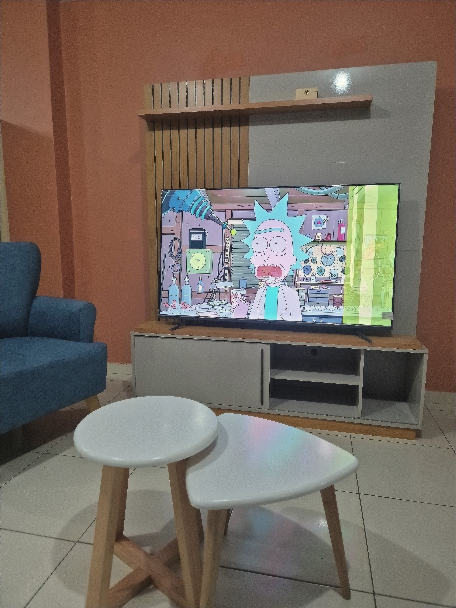
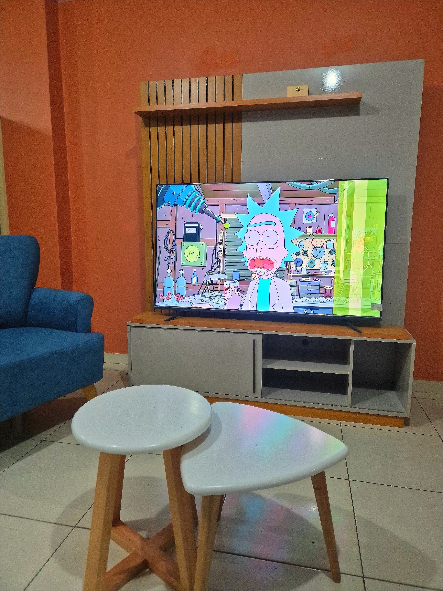

# FunucerCam: Real-Time Low-Light Image Enhancement for Budget Android Devices

[](https://kotlinlang.org/)
[](https://developer.android.com/)
[](https://opensource.org/licenses/MIT)

---

## ✨ Visual Demo: The Power of Shaders in Action

This section highlights the dramatic improvement achieved by applying our real-time GPU processing pipeline compared to the raw output of a low-end Android camera.

| Original Picture |                                                         Enhanced Result                                                         |
| :---: |:-------------------------------------------------------------------------------------------------------------------------------:|
|  |  |

### 🎬 Application Video Demo

Check out the full app running live on a budget device, demonstrating high FPS and low latency processing:

[Watch the Full Application Demo (app.mp4)](gallery/app.mp4)

---

## 🚀 Project Goal & Philosophy

This project is a **self-initiated open-source endeavor** designed to serve as a **technical guide and foundational reference** for the Android developer community.

The primary objective is to demonstrate a highly performant and stable method for improving photographic quality, particularly on **low-to-mid-range Android devices** where OEM camera processing is often insufficient. By providing this as an open-source asset, we aim to accelerate the development of better camera applications and foster a deeper understanding of low-level camera and graphics manipulation within the ecosystem.

## ✨ Key Technical Features: Low-Level Performance

The core strength of this application lies in its highly-optimized image processing pipeline, specifically tailored for maximum efficiency on resource-constrained hardware:

* **Direct Camera2 API Integration:** Utilizes the **Android Camera2 API** for granular, low-level control over camera hardware parameters, sensor data, and capture sessions, enabling maximum frame rate stability and minimal shutter lag.
* **Real-Time Shader Application:** Image manipulation and enhancement are achieved by applying **direct, custom-written OpenGL ES or Vulkan Shaders** within the Camera output surface pipeline. This is a critical distinction, as it completely bypasses slow CPU-bound processing (e.g., using `Bitmap` manipulation) and executes enhancements directly on the GPU.
    * This technique significantly reduces latency, making real-time noise reduction, sharpening, and tone mapping feasible even on budget devices.
* **Explicit State Management:** Clear separation of concerns for camera selection, parameter tuning, and image processing ensures a robust and testable codebase.

---

## 🏗 Architecture & Design Patterns

The application's architecture is built around modern Android development principles to ensure scalability, maintainability, and testability.

| Layer/Component | Technology/Pattern | Description |
| :--- | :--- | :--- |
| **User Interface** | **Jetpack Compose** | Utilizes declarative UI for rapid development and clean separation from logic. |
| **Architecture Pattern** | **Unidirectional Data Flow (UDF) / MVVM** | The architecture is heavily influenced by the **MVVM (Model-View-ViewModel)** pattern, with **ViewModels** exposing immutable state objects (`CameraViewState`) via Kotlin Flow, adhering to a Unidirectional Data Flow. |
| **Logic & State** | **State Holders (ViewModels)** | Responsible for managing the lifecycle of the `CameraDevice`, handling permission requests, and coordinating the image processing pipeline. |
| **Image Processing** | **Processor/Controller Pattern** | Dedicated classes like `ImageParametersController` and `CameraControls` abstract the complexity of interacting with the Camera2 API and managing shader parameters, adhering to the **Dependency Inversion Principle**. |
| **Language** | **Kotlin** | Fully written in Kotlin, leveraging coroutines for asynchronous operations (Camera callbacks, disk I/O) and Kotlin Flow for reactive state updates. |

---

## 🔜 Future Commercial Application

This demo project serves as a crucial **Foundational Proof-of-Concept (POC)**. The tested, high-performance Camera2 and Shader pipeline will be the technological core integrated into a new, **commercial photography application**.

This commercial product is currently under active development and is scheduled for a public launch in **December of this year** under my **Indie Developer** label.

---

## 🛠 Getting Started

To run the **FunucerCam** project locally, follow these steps.

### Prerequisites

* **Android Studio** (Electric Eel or later recommended)
* **Android SDK** (API Level 33+)
* An **Android device** running a recent OS version with Camera2 support (API 21+).

### Running the Project

1.  **Clone the Repository:**
    ```bash
    git clone [https://github.com/YourUsername/FunucerCam.git](https://github.com/YourUsername/FunucerCam.git)
    cd FunucerCam
    ```

2.  **Open in Android Studio:**
    Open the cloned directory in Android Studio. Wait for Gradle to sync dependencies.

3.  **Build and Run:**
    Select your target physical device (the camera functionality requires a physical device) and click the **Run** button (green arrow) in Android Studio.
    * The app will require **Camera** and **Storage** permissions on first launch.

### Important Notes

* Ensure your device supports the Camera2 API fully (Level 3 or higher is ideal for accessing advanced controls).
* Performance characteristics are device-dependent, particularly regarding GPU shader execution time.